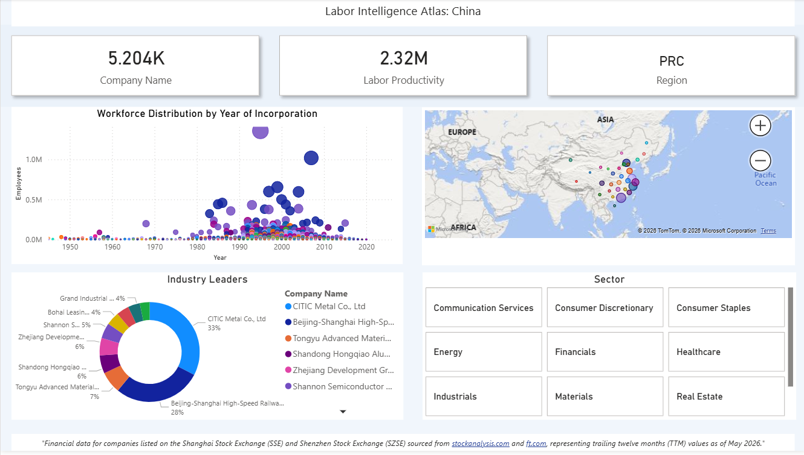
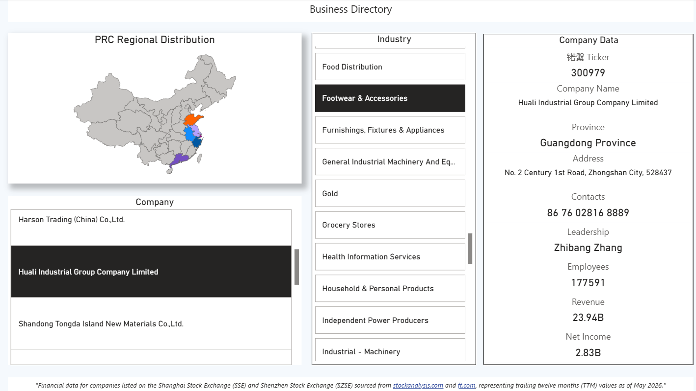
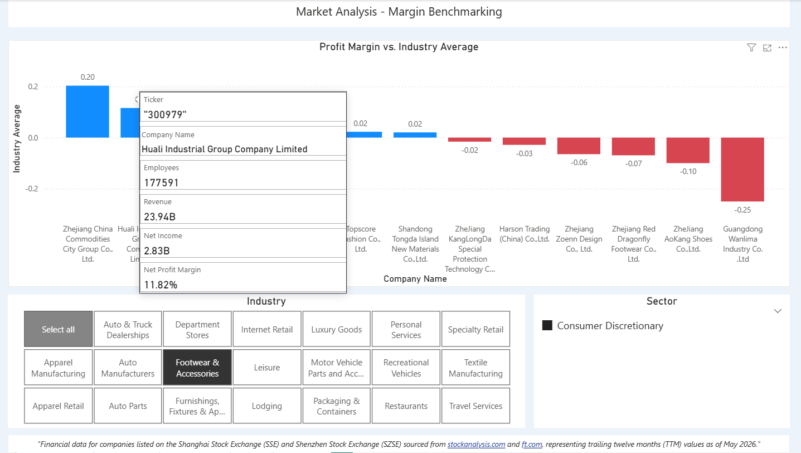

# China Labor Intelligence Atlas

Interactive Power BI report analysing 5,284 companies listed on the Shanghai (SSE) 
and Shenzhen (SZSE) stock exchanges, combining Python data scraping, DAX modelling, 
and geospatial analysis.

## Report Preview

## Data Sources
- [Shanghai Stock Exchange](https://english.sse.com.cn)
- [Shenzhen Stock Exchange](https://www.szse.cn/English)
- [StockAnalysis.com](https://stockanalysis.com)
- [Financial Times](https://www.ft.com)

## Disclaimer
This report was developed for academic purposes only. All data is sourced from 
publicly available information.
